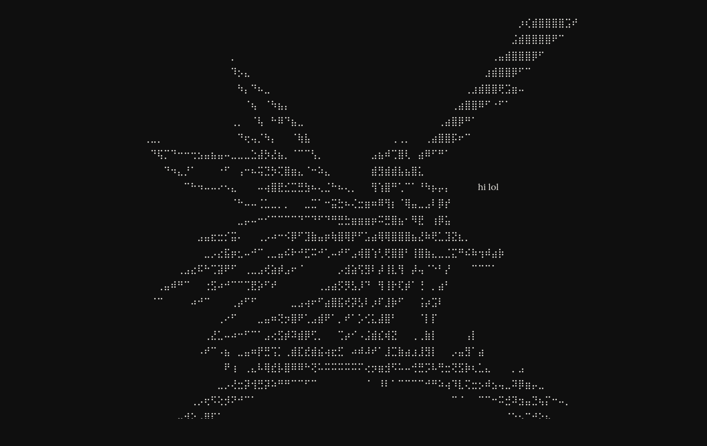

# chaotic-note

a note that lives in the url. pass it to someone. they can't delete what you wrote.


## how it works

every time you type, the note gets encoded into the url. send that url to someone — they open it, see what you wrote, add their own words, and send a new url back. no accounts, no backend, no database holding your thoughts hostage.

the only rule: you can't delete anything. not yours, not theirs.

## features

- **the link is the document** — the entire note is base64 encoded in the url
- **no deletions** — once written, it stays
- **read-only fade** — the page dims after 5 seconds of inactivity, brightens when you move
- **shared latest** — `/note` always loads the most recently updated version via jsonbin

## run locally

```bash
git clone https://github.com/yourusername/chaotic-note
cd chaotic-note
npm install
```

create a `.env` file at the root:

```
VITE_BIN_ID=your_bin_id
VITE_API_KEY="your_api_key"
```

then:

```bash
npm run dev
```

## live

[chaotic-note.vercel.app](https://chaotic-note.vercel.app)